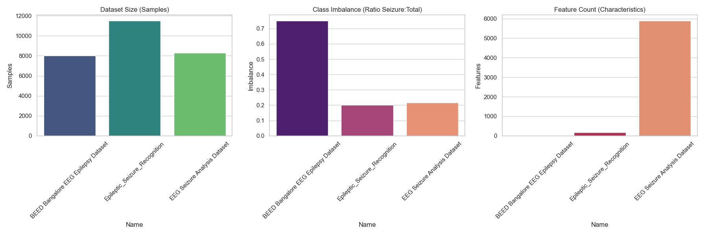
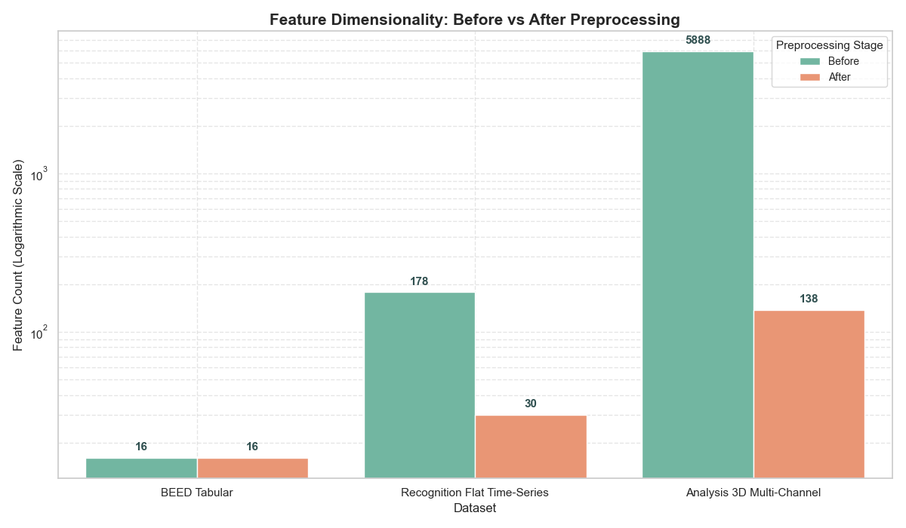
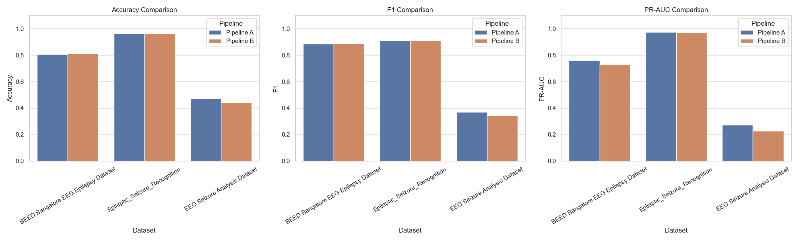
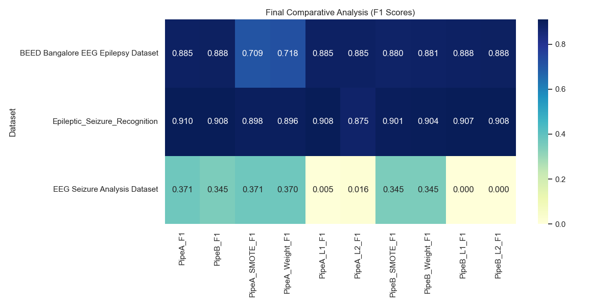

# Epileptic Seizure Prediction: Comparative Analysis

## Overview
This project presents a rigorous comparative analysis of machine learning strategies for **Epileptic Seizure Prediction**. By evaluating Logistic Regression models across three distinct EEG datasets, the study investigates how preprocessing order, regularization techniques, and class imbalance handling interact to affect model generalization and stability.

## Key Research Objectives
- **Preprocessing Impact**: Evaluating the performance difference between Filter-First (Pipeline A) and Feature-First (Pipeline B) strategies.
- **Dynamic Feature Compression**: Measuring the dimensionality reduction and signal preservation of statistical moments extraction vs. Principal Component Analysis (PCA).
- **Regularization Sparsity**: Analyzing the feature-selection effects of L1 (Lasso) vs. L2 (Ridge) and their interaction with high-frequency noise.
- **Class Imbalance Mitigation**: Quantifying the Precision-Recall tradeoff and the necessity of applying SMOTE on strictly non-leaked training folds.

---

## Datasets Analyzed
1.  **BEED Bangalore EEG Epilepsy Dataset**: 8,000 samples. Pure static tabular data pre-compressed by experts. Relatively balanced (75.0% seizure samples).
2.  **Epileptic Seizure Recognition**: 11,500 samples. Tabularized single-channel 1-D flat time-series (178 features). Moderately imbalanced (20.0% seizure samples).
3.  **EEG Seizure Analysis Dataset**: 8,282 samples. Complex 3-D multi-channel raw EEG signals (23 channels x 250 time steps). Moderately imbalanced (21.7% seizure samples).

---

## Implementation Details

### 1. Preprocessing Pipelines
- **Pipeline A (Filter-First)**: `Bandpass Filter (0.5Hz - 40Hz)` → `Statistical Moments (Mean, Std, Max, Min, Skew, Kurtosis)` → `SimpleImputer`. Prioritizes raw signal cleaning before extraction.
- **Pipeline B (Feature-First)**: `Statistical Moments` → `SimpleImputer` → `StandardScaler` → `PCA (95% variance)`. Extracts features directly from raw noisy signals, standardizes, and uses PCA to compress channels.

### 2. Regularization Study
- **L1 (Lasso)**: Drives redundant temporal features to exactly zero, acting as an automated feature selector (achieved **82.5% sparsity** on Recognition Dataset while maintaining a 0.908 F1-score).
- **L2 (Ridge)**: Shrinks weights uniformly but keeps all features active. Ideal for clean, independent static tables (like BEED).

### 3. Handling Class Imbalance
- **SMOTE**: Slicing the raw signals and oversampling the minority class allowed the model to find a stable classification hyper-plane, unlocking the model on Dataset 3 (F1 from 0.000 to 0.371).
- **Class Weighting**: Cost-sensitive learning adjusting penalties for the minority class.

---

## Key Results & Visualizations

### 1. Dataset Characteristics & Feature Compression
Justification of the dataset selection based on size, class imbalance ratio, and raw feature complexity, and the impact of the feature extraction engines.

| Dataset Size & Imbalance | Feature Compression Impact |
| :---: | :---: |
|  |  |

### 2. Final Comparative Performance
The maximum F1 scores achieved by each pipeline under optimal configuration, and the cross-experiment performance heatmap.

| Optimal Pipeline F1 Metrics | Configuration Heatmap |
| :---: | :---: |
|  |  |

---

## Key Insights from Comparative Analysis
- **Preprocessing Order**: Filtering continuous waves *before* extraction (Pipeline A) outperforms PCA-first architectures (Pipeline B). PCA on raw signals scales and compresses unfiltered high-frequency noise, degrading clinical patterns.
- **Imbalance Handling as a Prerequisite**: Without balancing (SMOTE or Class Weighting), models fall into the accuracy trap (predicting majority class to get ~78.3% accuracy but 0.0 F1). Regularization is useless until class imbalance is mathematically corrected.
- **L1 Lasso is a Clinical Feature Selector**: Discarding redundant consecutive sequence steps prevents overfitting to high-frequency artifacts.

---

## Project Structure
- `data_loader.py`: Unified loading logic for CSV and NPZ multi-channel formats.
- `pipelines.py`: Custom Scikit-Learn pipelines (`EEGBandpassFilter`, `EEGFeatureExtractor`).
- `model_engine.py`: Leak-free ImbPipeline CV, training logic, and learning curve simulations.
- `visualizer.py`: Custom Matplotlib/Seaborn visualization suite.
- `main.py`: Main orchestration script automating the entire dual-pipeline evaluation.
- `Research_Report.md`: Full rigorous IEEE-style research report containing all mathematical formulas and answers.

## How to Run
```bash
# Install dependencies
pip install numpy pandas scikit-learn matplotlib seaborn imbalanced-learn scipy

# Run the complete experiment suite
python main.py
```
*Results and comprehensive visualizations will be automatically saved in the `plots/` directory.*
